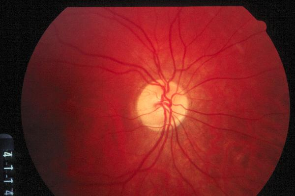
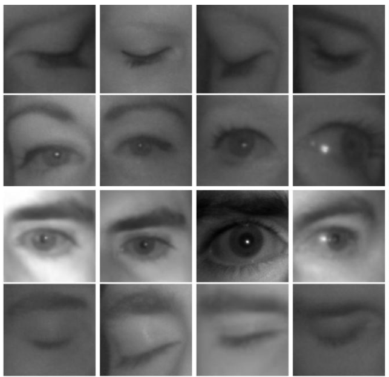

# Dados utilizados para treinamento e testes

Este diretório possui as imagens que foram utilizadas para treinamento e teste dos classificadores. Possui dois diretórios, train e teste que representam as imagen de treinamento e testes respectivamente.

Cada diretório possui mais dois subdiretórios, fundusImage e other, que são as imagens de fundo de olho e imagens de um olho humano, fechado e aberto que irão representar as outras imagens que não são interessantes para um classificador de glaucoma.

- data
    - train
        - fundusImage
        - other
    - test
        - fundusImage
        - other

O diretório train possui no total 700 imagens, onde cada diretório possui 350 imagens.

O diretório test possui no total 300 imagens, onde cada diretório possui 150 imagens.

**Imagens de fundo de olho**

As imagens foram obtidas de base de dados disponibilizadas online:
- DRIONS-DB (Digital Retinal Images for Optic Nerve Segmentation Database);
- DRIVE (Digital Retinal Images for Vessel Extraction);
- BinRushed;
- Magrabia.

Exemplo de imagem de fundo de olho:

**Imagens de olho humano**

As imagens de olho humano utilizadas, onde contem olhos abertos e fechados, foram encontradas no site do [Media Research Lab](http://mrl.cs.vsb.cz//index.html).

Exemplo de imagem da pasta other:

